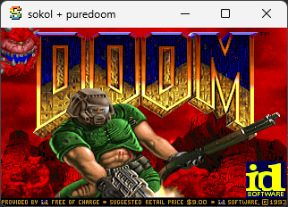
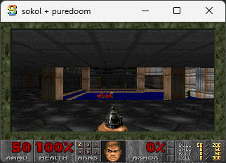
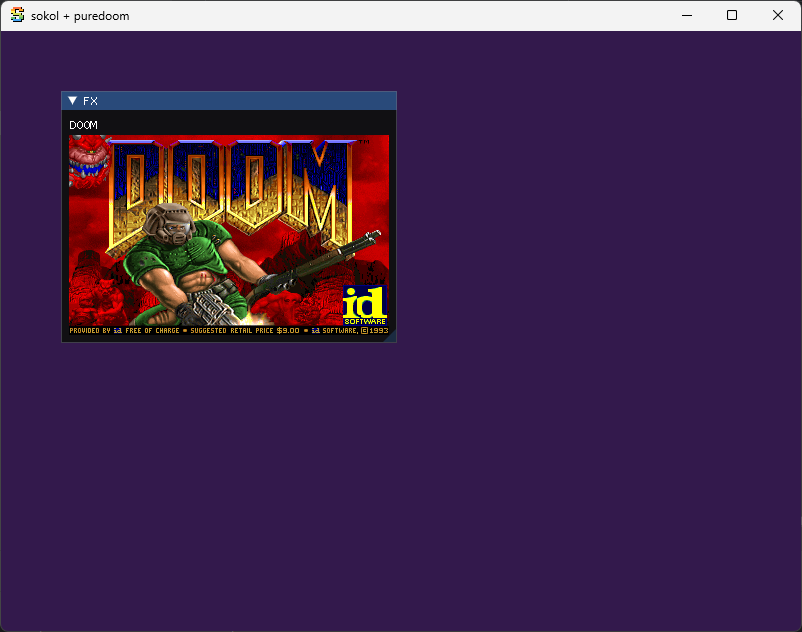

# Sokol + puredoom

NEVER TRY COMPILE C99 WITH MSVC!

There is also an [ImDrawList API Demo](https://github.com/CU-Production/hello_doom/tree/ImDrawList)

# Reference

- https://github.com/ocornut/imgui/blob/master/docs/FAQ.md#q-how-can-i-display-custom-shapes-using-low-level-imdrawlist-api
- https://github.com/ocornut/imgui/issues/3606
- https://github.com/Daivuk/PureDOOM
- https://github.com/floooh/sokol
